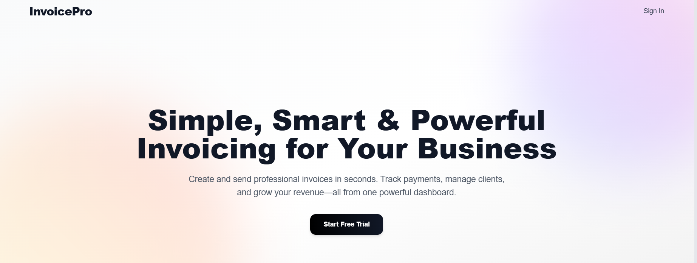

# InvoiceX — SaaS Invoicing Platform

A full-stack SaaS platform for creating, managing, and sending invoices with Stripe payment integration, Auth0 OAuth login, and a real-time dashboard for freelancers and small businesses.

> **Demo:** https://www.loom.com/share/7d8b9b2f75594dedb4bac82f146f7ebe

---

## Table of Contents

- [Features](#features)
- [Screenshots](#screenshots)
- [System Architecture](#system-architecture)
- [Tech Stack](#tech-stack)
- [API Endpoints](#api-endpoints)
- [Getting Started](#getting-started)
- [Deployment](#deployment)
- [Future Enhancements](#future-enhancements)

---

## Features

### Invoicing
- Create, edit, delete, and send invoices with dynamic line items
- Invoices default to draft status until manually sent or paid
- Export invoices as static PDF with caching for fast downloads
- Filter, sort, and search across all invoices from a clean dashboard

### Payments
- Stripe Checkout integration for seamless client payment flow
- Webhook-based real-time invoice status updates — handles succeeded, failed, and refunded events
- Stripe webhook signature verification to prevent spoofed events
- Multi-currency support handled dynamically (INR, USD, etc.)

### Authentication
- OAuth login via Google and GitHub using Auth0 by Okta
- Session-based auth management with Auth0 SDK
- Role-based access control architecture for future team accounts
- HTTPS enforced on all endpoints with no unencrypted PII storage

### Dashboard
- Track total invoices, total clients, and total income at a glance
- Manage clients — add, view, and remove client records
- Edit and send invoices manually from the admin panel

---

## Screenshots




---

## System Architecture

```
┌─────────────────────────────────────────────────────────┐
│                        Client                           │
│          Next.js (SSR) + Tailwind CSS + Stripe.js       │
└──────────────────────┬──────────────────────────────────┘
                       │ REST API
┌──────────────────────▼──────────────────────────────────┐
│                    Backend (Node.js)                    │
│         Express.js + Auth0 SDK + Rate Limiting          │
│              Async Handlers + Error Middleware           │
└──────┬───────────────┬────────────────┬─────────────────┘
       │               │                │
┌──────▼──────┐ ┌──────▼──────┐ ┌──────▼──────┐
│   MongoDB   │ │   Auth0     │ │   Stripe    │
│   Atlas     │ │  (OAuth)    │ │  (Payments  │
│  (Primary)  │ │             │ │  + Webhooks)│
└─────────────┘ └─────────────┘ └─────────────┘
```

**Key Design Decisions:**
- **Monolith-first architecture** — chosen deliberately over microservices for a SaaS at this scale. Clean frontend/backend separation with room to extract services later
- **Auth0** offloads authentication entirely — no custom auth logic, no password storage, immediate OAuth support for Google and GitHub
- **Stripe Webhooks** over polling — invoice status updates are event-driven, not request-driven. Webhook signing secret verifies every event to prevent spoofing
- **Stateless backend on Render** — enables horizontal scaling without session stickiness issues
- **MongoDB Atlas** for document-based invoice and client storage — flexible schema handles varying invoice line items without migrations

---

## Tech Stack

| Layer | Technology |
|---|---|
| Frontend | Next.js, React, Tailwind CSS, Stripe.js |
| Backend | Node.js, Express.js |
| Auth | Auth0 by Okta (Google + GitHub OAuth) |
| Payments | Stripe (Checkout, Webhooks, Multi-currency) |
| Database | MongoDB Atlas, Mongoose ODM |
| DevOps | GitHub Actions (CI/CD), Vercel, Render |

---

## API Endpoints

### Authentication (Auth0 Managed)
| Method | Endpoint | Description |
|---|---|---|
| GET | `/api/me` | Get user profile |
| POST | `/api/logout` | Logout user |

### Invoices
| Method | Endpoint | Description |
|---|---|---|
| GET | `/api/invoices` | List all invoices |
| POST | `/api/invoices` | Create a new invoice |
| GET | `/api/invoices/:id` | Get specific invoice |
| PUT | `/api/invoices/:id` | Update invoice |
| DELETE | `/api/invoices/:id` | Delete invoice |

### Clients
| Method | Endpoint | Description |
|---|---|---|
| GET | `/api/clients` | Get all clients |
| POST | `/api/clients` | Add a client |
| DELETE | `/api/clients/:id` | Remove a client |

### Payments
| Method | Endpoint | Description |
|---|---|---|
| POST | `/api/checkout` | Initiate Stripe checkout session |
| POST | `/api/webhook` | Stripe webhook for payment events |

---

## Getting Started

### Prerequisites
- Node.js v18+
- MongoDB Atlas account
- Stripe account (test mode)
- Auth0 account

### Installation

```bash
# Clone the repository
git clone https://github.com/diwakarworks/invoice-saas.git
cd invoice-saas

# Install backend dependencies
cd server
npm install

# Install frontend dependencies
cd ../client
npm install
```

### Running Locally

```bash
# Start backend
cd server
npm run dev

# Start frontend
cd client
npm run dev
```

---

## Deployment

| Service | Platform |
|---|---|
| Frontend | Vercel (CI from GitHub) |
| Backend | Render.com |
| Database | MongoDB Atlas |
| CI/CD | GitHub Actions |

---

## Future Enhancements

- **Invoice Reminders** — automated client follow-ups via n8n or cron jobs
- **Recurring Invoices** — scheduled invoice generation with repeat billing
- **Invoice Templates** — custom branding with logo and preset line items
- **Team Accounts** — role-based access for multi-user SaaS teams
- **Analytics** — invoice opened, viewed, and paid tracking per client

---

## Author

**Diwakar G** — [Portfolio](https://my-portfolio-ten-sandy-76.vercel.app) | [LinkedIn](https://www.linkedin.com/in/diwakar-6719b0213) | [GitHub](https://github.com/diwakarworks)
